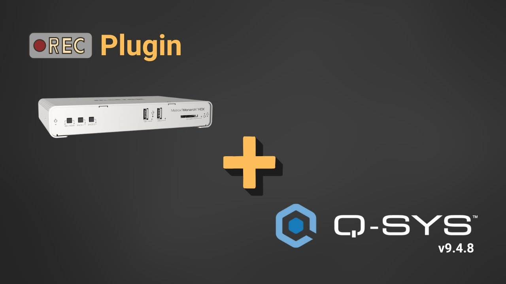

# Q-SYS Matrox Monarch HDX Rec Control Plugin

##  Project Overview

This plugin was developed to provide **centralized control and monitoring** of the **Matrox Monarch HDX** encoder within the Q-SYS audio and control ecosystem. The objective is to integrate the Matrox's recording and streaming functionality directly into the Q-SYS Designer interface, eliminating the need for complex network programming.

The plugin handles:
* **HTTPS/RESTful API** communication with the Matrox (including authentication).
* Real-time status **Polling** (Recording State, Operation Mode).
* Bidirectional control (Start/Stop).
* HTTP status feedback and handling of *timeout* or *retry* events.

##  Installation and Configuration

### 1. Requirements

* Q-SYS Core with Firmware **v9.4.8** (Not tested on other versions).
* Q-SYS Designer **v9.4.8** (Not tested on other versions).
* Matrox Monarch HDX encoder.
* Network configuration allowing **HTTPS (Port 443)** communication between the Q-SYS Core and the Matrox unit.

### 2. Adding the Plugin to Q-SYS Designer

1.  **Download** the `.qplug` file and copy it to the local plugins/extensions folder for Q-SYS Designer. Install the plugin by double-clicking the file.
2.  In Q-SYS Designer, open the **Component Library**.
3.  Locate **Plugins** and drag the **User Matrox Monarch Control** component onto your schematic.

## 📽️ Video Tutorial & Demonstration

For a complete step-by-step guide on installation and usage, click the image below to watch the tutorial on YouTube:

### 3. Configuration Properties

After adding the plugin, configure the following properties in the component's **Properties** tab:

| Property | Type | Description | Example |
| :--- | :--- | :--- | :--- |
| `HostIP` | String | IP Address of the Matrox encoder. | `192.168.1.100` |
| `Username` | String | Username for Matrox authentication. | `admin` |
| `Password` | String | Password for Matrox authentication. | `[YOUR_PASSWORD]` |
| `PollingInterval` | Number | Time interval for status updates (integer in seconds). | `2` |

---

## 2. LICENSING AND CREDITS

### 2.1. Intellectual Property (IP)

This plugin was developed by **Daniel Lorenzo Silveira Alves** during collaboration/internship activities for the **Superior Tribunal de Justiça (STJ)** (Brazilian Superior Court of Justice) within the Integrated Audio and Video Solutions Section (SAVID).

### 2.2. Public Use License (MIT)

To encourage community collaboration and reuse, this code is distributed under the **MIT License** (Massachusetts Institute of Technology).

The MIT License is permissive, allowing the use, modification, and redistribution of the code.

> **Important:** The code is provided "as is," without any warranty. The STJ is not responsible for any damages or issues resulting from the use of this software by third parties.

## 3. CONTRIBUTIONS

We value continuous improvement and community collaboration.

* **Bugs/Issues:** If you find an error, please open an **Issue** on this repository.
* **Code Enhancements:** Code proposals, new features, or fixes should be submitted via **Pull Requests (PRs)**.

Thank you for your interest and contribution!

---
*Author: Daniel Lorenzo Silveira Alves*
*Project Idealization: Bruno Mariani de Melo*
